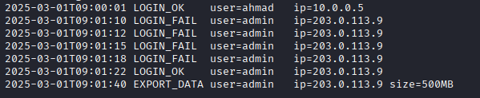
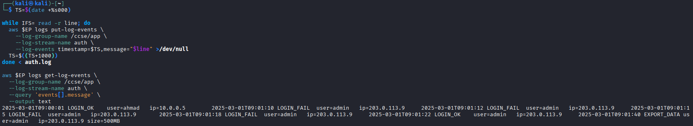
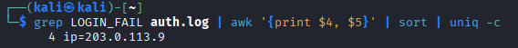
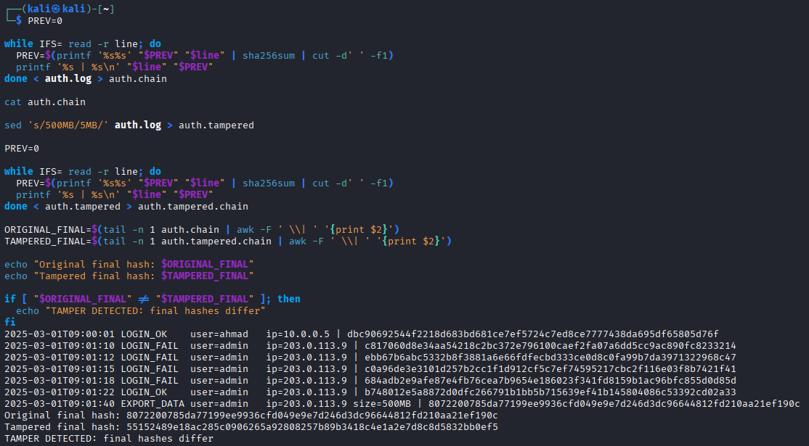
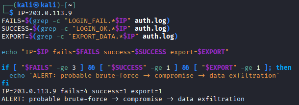
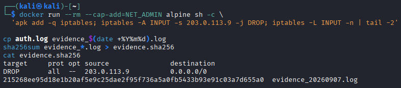
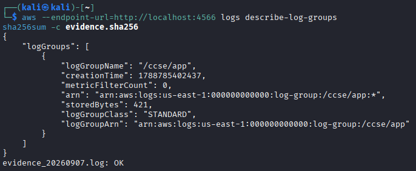

# IKB42603 Cloud Computing Security Essentials - Lab 5 Report

## Monitoring, Logging & Incident Detection

**Student name:** :Putera Aiman Firdaus Bin Zaini  
**Student ID:** 52215124834
**Date performed:** 5/9/2026 
**Environment:** Docker, LocalStack, AWS CLI v2, Git Bash or WSL

## Objective

This lab centralised authentication logs in a LocalStack CloudWatch Logs service, queried failed logins, protected log integrity with a SHA-256 hash chain, correlated related security events, and performed basic incident-response actions.

## Evidence index

| Task | Required evidence | Screenshot / file |
|---|---|---|
| 1 | Generated `auth.log` | `evidence/task1-auth-log.png` |
| 2 | CloudWatch `get-log-events` read-back | `evidence/task2-centralised-readback.png` |
| 3 | Failed-login count grouped by IP | `evidence/task3-failed-login-count.png` |
| 4 | `auth.chain` plus different original/tampered final hashes | `evidence/task4-hash-chain-and-tamper.png` |
| 5 | Correlation output and ALERT | `evidence/task5-correlation-alert.png` |
| 6 | Containment rule and `evidence.sha256` | `evidence/task6-containment-and-hash.png` |
| Verification | Log group plus successful evidence-hash verification | `evidence/verification.png` |

## Task 1 - Generate application logs

The authentication log contained one successful login by `ahmad`, four failed login attempts from `203.0.113.9` against the `admin` account, a successful `admin` login from the same IP, and a 500 MB data export. The latter sequence was intentionally retained for later correlation.

## Task 2 - Centralise logs

I created the `/ccse/app` log group and its `auth` stream in LocalStack, then shipped every line in `auth.log` to CloudWatch Logs. Reading the stream back showed that the central store contained the complete source log.

## Task 3 - Query security-relevant activity

The query grouped failed authentication attempts by source IP. It identified four failures associated with `203.0.113.9`, an indicator of an authentication attack.

## Task 4 - Tamper-evident logging

I generated `auth.chain` by hashing each record together with the hash of the preceding record, starting with `0`. I then changed the export size from `500MB` to `5MB` in a separate `auth.tampered` file and recalculated the chain. The original final hash was `8072200785da77199ee9936cfd049e9e7d246d3dc96644812fd210aa21ef190c`; the tampered final hash was `55152489e18ac285c0906265a92808257b89b3418c4e1a2e7d8c8e58832bb0ef5`. Because the values differ, the alteration was detected.

## Task 5 - Incident correlation

Correlation for `203.0.113.9` produced four failures, one success, and one data export. Together these events triggered the alert: `probable brute-force -> compromise -> data exfiltration`.

## Task 6 - Containment and evidence collection

I modelled containment with an iptables rule that dropped traffic from `203.0.113.9`. I made a timestamped evidence copy of the original log and calculated its SHA-256 checksum in `evidence.sha256`. This hash provides a baseline for checking that the collected evidence has not changed.

## Verification

The `/ccse/app` log group remained available in LocalStack, and `sha256sum -c evidence.sha256` returned `OK` for the timestamped evidence file.

## Incident report

### Detection

The detection rule correlated four failed `admin` logins from `203.0.113.9`, followed by a successful login and a 500 MB `EXPORT_DATA` action from the same address. The correlated sequence raised an alert for a probable brute-force compromise followed by data exfiltration.

### Analysis

No single record conclusively showed an incident: failed logins can be ordinary user error, a successful login alone is normal, and an export needs context. Their close sequence and shared source IP made the activity suspicious. The likely scenario is that the attacker repeatedly guessed credentials, gained access to the `admin` account, and exported a large amount of data.

### Containment

I added a model iptables DROP rule for `203.0.113.9` to stop further inbound traffic from the suspected source. In a production response, I would also disable or reset the affected account, revoke active sessions or credentials, preserve relevant cloud logs, and investigate the scope of the export.

### Evidence & integrity

I preserved the original `auth.log` as a timestamped evidence copy and recorded its SHA-256 digest in `evidence.sha256`. I also demonstrated that changing `500MB` to `5MB` changes the final hash-chain value. The hash chain exposes modifications because each record's hash depends on its own content and every prior hash; a changed record therefore changes that record and all later links. To resist an attacker who controls the application host, the final hash or complete chain should be forwarded to a separate append-only store.

### Lesson learned

Centralised, integrity-protected logs make it possible to discover multi-step attacks and support defensible investigation. Detection is stronger when a monitoring rule correlates related events rather than treating each record independently.

## Short-answer questions

### Q1. What is the difference between a log and an event? Give an example of each from this lab.

A **log** is a durable record of an activity. For example, `2025-03-01T09:01:12 LOGIN_FAIL user=admin ip=203.0.113.9` is a stored authentication log entry. An **event** is a meaningful occurrence or trigger derived from activity, often used for an alert. In this lab, the event is the near-real-time alert that four failures came from `203.0.113.9`.

### Q2. Why must audit logs be tamper-proof, and how does a hash chain achieve this?

Audit logs must be tamper-proof or tamper-evident so they remain trustworthy for detection, forensics, and compliance evidence. In a hash chain, each record is hashed together with the previous hash. Editing one record changes its digest and changes every subsequent digest, so a stored final hash or an independently retained chain exposes the change.

### Q3. How did correlation detect an incident that no single log line revealed?

Correlation combined four failed logins, a later successful login, and a large export from the same IP address. Each record can be benign in isolation, but their shared IP and sequence indicated probable brute-force compromise followed by data exfiltration.

### Q4. List the incident-response steps you performed and the goal of each.

1. **Detect:** queried and correlated the authentication and export records to identify the suspected attack.
2. **Contain:** added a DROP rule for `203.0.113.9` to prevent further access from that source.
3. **Collect evidence:** copied the original log to a timestamped evidence file and calculated a SHA-256 checksum to preserve and verify integrity.
4. **Document:** recorded the detection, analysis, containment action, evidence, and lesson learned in this report.

### Q5. How do the same logs serve both security monitoring and compliance evidence (Weeks 6, 11)?

For security monitoring, the records are queried and correlated to identify suspicious activity and trigger a response. For compliance, centralised and integrity-protected records provide an auditable trail showing what occurred, when it occurred, and that the retained evidence has not been changed.

## Final checklist

- [ ] Centralised CloudWatch read-back captured.
- [ ] Failed-login query grouped by IP captured.
- [ ] Hash chain and changed final hash captured.
- [ ] Correlation alert captured.
- [ ] Containment rule and evidence checksum captured.
- [ ] `aws --endpoint-url=http://localhost:4566 logs describe-log-groups` captured.
- [ ] `sha256sum -c evidence.sha256` captured with `OK`.
